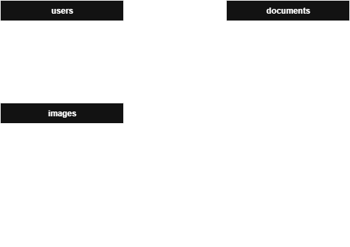

# Database

This document describes the database structure, collection relationships, and JSON schema used by the application.

## Relationships



users : documents (1:cm) -> One user *can* have *multiple* documents. One document *must* be assigned to *one* user.

documents : images (1:cm) -> One document *can* have *multiple* images. One image *must* be assigned to *one* document.

## JSON Schema

```json
{
	"users": {
		"$jsonSchema": {
			"bsonType": "object",
			"required": ["_id", "username", "password"],
			"properties": {
				"_id": {
					"bsonType": "objectId"
				},
				"username": {
					"bsonType": "string"
				},
				"password": {
					"bsonType": "string"
				}
			}
		}
	},
	"documents": {
		"$jsonSchema": {
			"bsonType": "object",
			"required": ["_id", "userId", "content", "flags", "title", "version"],
			"properties": {
				"_id": {
					"bsonType": "objectId"
				},
				"userId": {
					"bsonType": "objectId",
					"description": "References users._id"
				},
				"content": {
					"bsonType": "string"
				},
				"flags": {
					"bsonType": "object",
					"required": ["deleted"],
					"properties": {
						"deleted": {
							"bsonType": "bool"
						}
					}
				},
				"title": {
					"bsonType": "string"
				},
				"version": {
					"bsonType": "int"
				}
			}
		}
	},
	"images": {
		"$jsonSchema": {
			"bsonType": "object",
			"required": ["_id", "docId", "data", "mimeType", "name", "size"],
			"properties": {
				"_id": {
					"bsonType": "objectId"
				},
				"docId": {
					"bsonType": "objectId",
					"description": "References documents._id"
				},
				"data": {
					"bsonType": "binData"
				},
				"mimeType": {
					"bsonType": "string"
				},
				"name": {
					"bsonType": "string"
				},
				"size": {
					"bsonType": "int"
				}
			}
		}
	}
}
```
