# Frontend

--> introduction

## Contents

- [Processes](#processes)
    - [Documents](#documents)
        - [Document Synchronization](#document-synchronization)
        - [Individual Synchronization Steps for Local Documents](#individual-synchronization-steps-for-local-documents)
        - [Individual Synchronization Steps for Server Documents](#individual-synchronization-steps-for-server-documents)
        - [Document Creation](#document-creation)
        - [Document Deletion](#document-deletion)
        - [Document Update](#document-update)
    - [Images](#images)
        - [Image Synchronization](#image-images)
        - [Image Synchronization to Local Storage](#image-synchronization-to-local-storage)
        - [Image Synchronization to Server](#image-synchronization-to-server)
        - [Image Display](#image-display)
        - [Image Creation](#image-creation)
        - [Image Deletion](#image-deletion)
    - [Responsiveness](#responsiveness)
        - [Login Page](#login-page)
        - [Editor Page](#editor-page)
    - [Dependencies](#dependencies)
        - [Production Dependencies](#production-dependencies)
        - [Development Dependencies](#development-dependencies)

## Processes

### Documents

The synchronization process starts with useDocuments being mounted. The application loads the documents from local storage and from the server in parallel, creates individual synchronization tasks, executes the tasks, and waits for all tasks to finish:

#### Document Synchronization

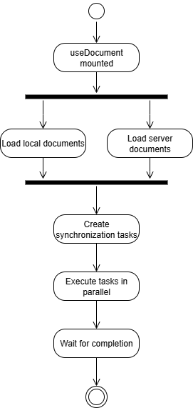

#### Individual Synchronization Steps for Local Documents

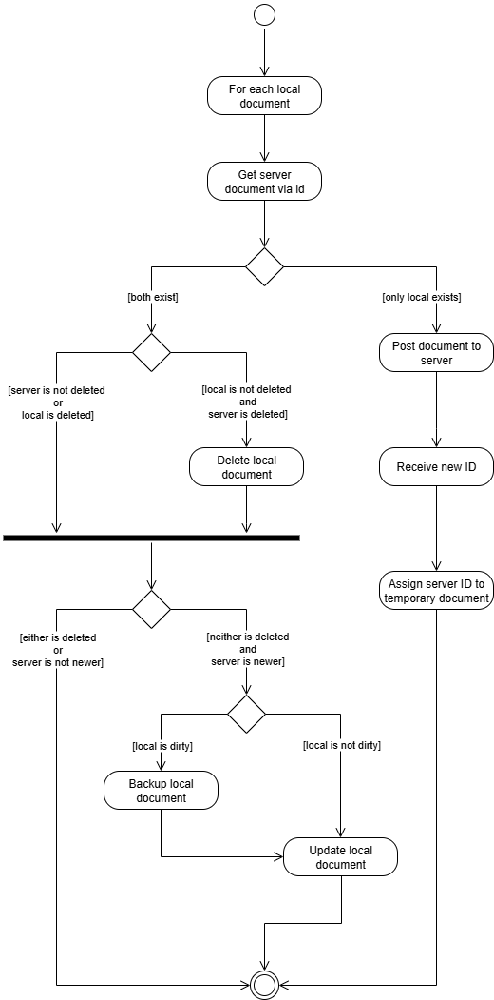

#### Individual Synchronization Steps for Server Documents

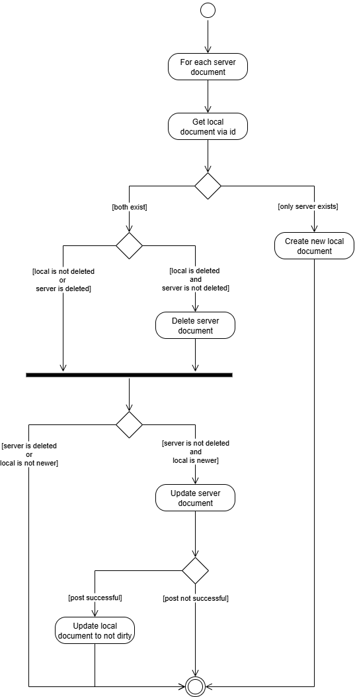

#### Document Creation

1. Create a document using a temporary id.
2. Post the document to the server.
    - If the server returns status 201 replace the temporary record with the newly created document.
    - Else retain the temporary document.

**Purpose**:
This approach allows the user to continue working with the temporary document. The next successful synchronization replaces the temporary record with a document containing a valid id.

#### Document Deletion

Document records are not physically deleted from either the local storage or the server. Instead, the `deleted` flag of the local document is set to `true`. 

1. Set the local document's `deleted` flag to `true`.
2. Synchronize the soft-deletion with the server.
    - If an internet connection is available, update the corresponding server document immediately.
    - If the server cannot be reached, synchronize the change during the next synchronization.

Purpose: This allows the deletion to be propagated reliably even when the client is temporarily offline.

#### Document Update

Document changes are directly saved to the local storage and the server. For both write accesses (server and local storage) a debouncer reduces the amount of unnecessary operations. 

A change triggers:

1. `dirty` flag of the document is set to `true`
2. The document is written to local storage (debounced)
3. A patch is send to the server.
    - If the patch was successful, `dirty` is set to `false`
    - If the patch was not successful, the `dirty` flag is retained

### Images

#### Image Synchronization

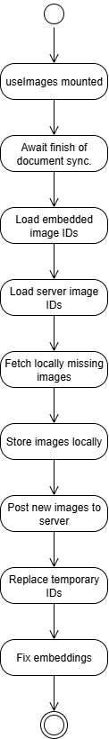

#### Image Synchronization to Local Storage

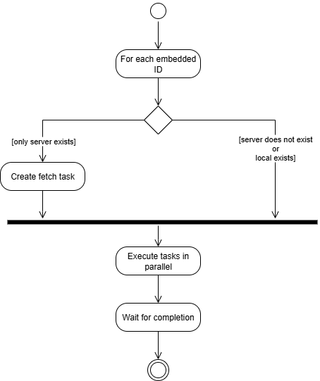

#### Image Synchronization to Server

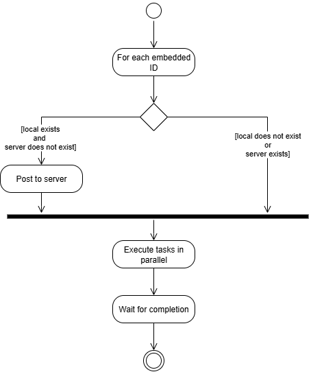

#### Image Display

An embedding `` in the document acts as a placeholder for the actual image. 
A codemirror plugin substitutes these placeholders with the URL of the corresponding image.
These URLs are managed by a cache and appropriate services, which is responsible for the following functions:

1. Create URLs for all images that belong to the document that is becoming active.
2. Revoke URLs for all images that belong to the document that is becoming inactive. 
3. Create URL after a document has been created by drag and drop event.
4. Replace cached URL after a temporary image record was replaced by a permanent image.

#### Image Creation

Image creation is initiated by a drag and drop event at the editor window.

1. A local image record is created using a temporary id.
2. An embedding is inserted at the dropped row.
3. The image is displayed.
4. Post the image to the server. 
    - If the server returns 200 replace the temporary record with the newly created image and replace the embedded ID in the document.
    - Else retain the temporary record.

#### Image Deletion

The user initiates image deletion by initiating a document deletion. Here, all images with the corresponding `docId` field are deleted both from local storage and from the server.

## Responsiveness

### Login Page

Due to its limited amount of content, the login page requires only one breakpoint, based on a maximum viewport height of 576px.
Below this threshold, the logo is no longer displayed to ensure that the login and registration forms remain accessible on smaller screens.

Full-size Login & Register:
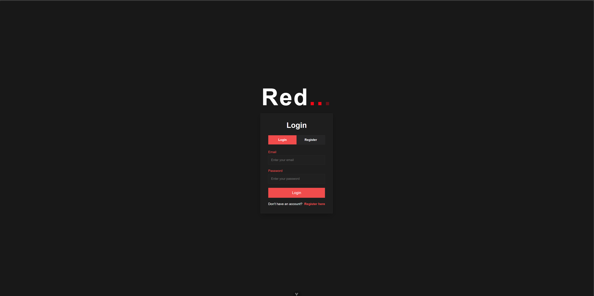
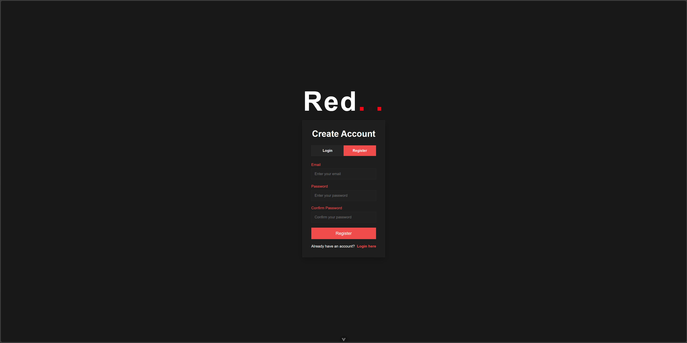

Below max-height 576px breakpoint:
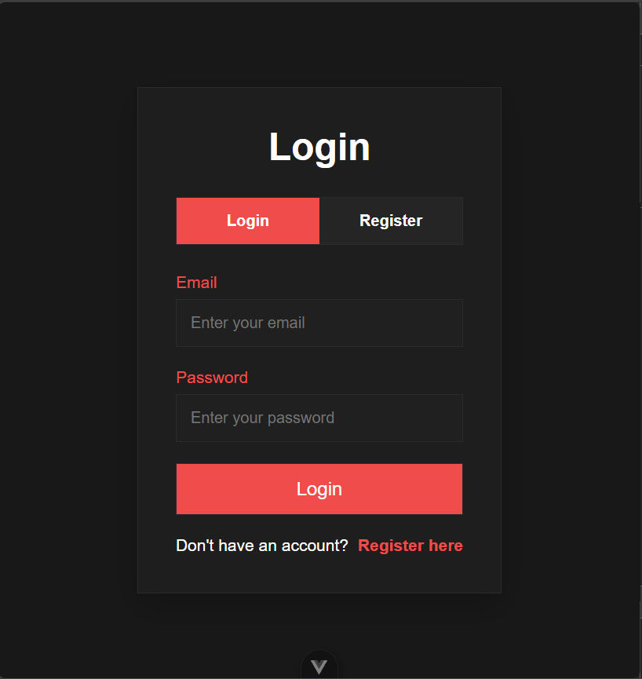
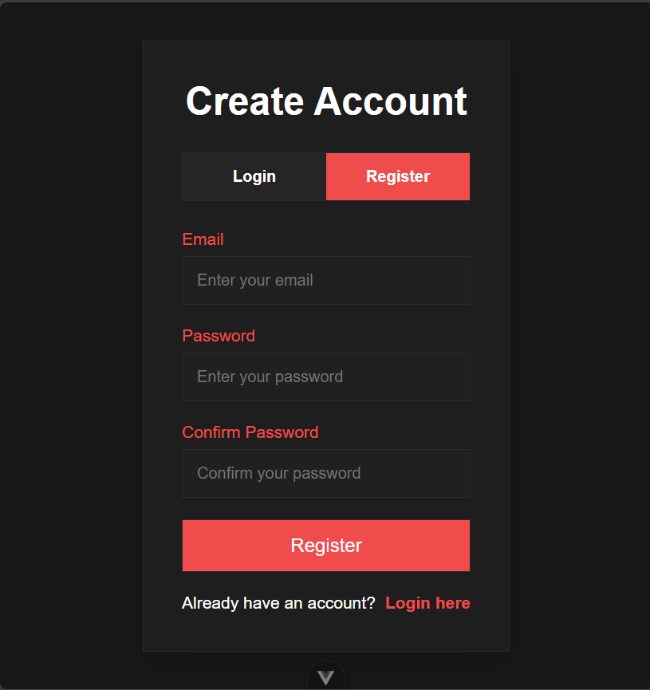

No width-breakpoint has been specified as the login/registration page remains readable down to 320 pixels of viewpoint width.

### Editor Page

Full-size:

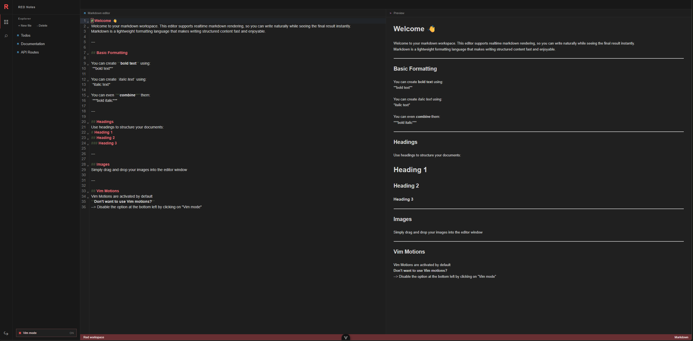

The editor page includes 3 media breakpoints:

- max-width 1200px: reduce the size of the sidebar

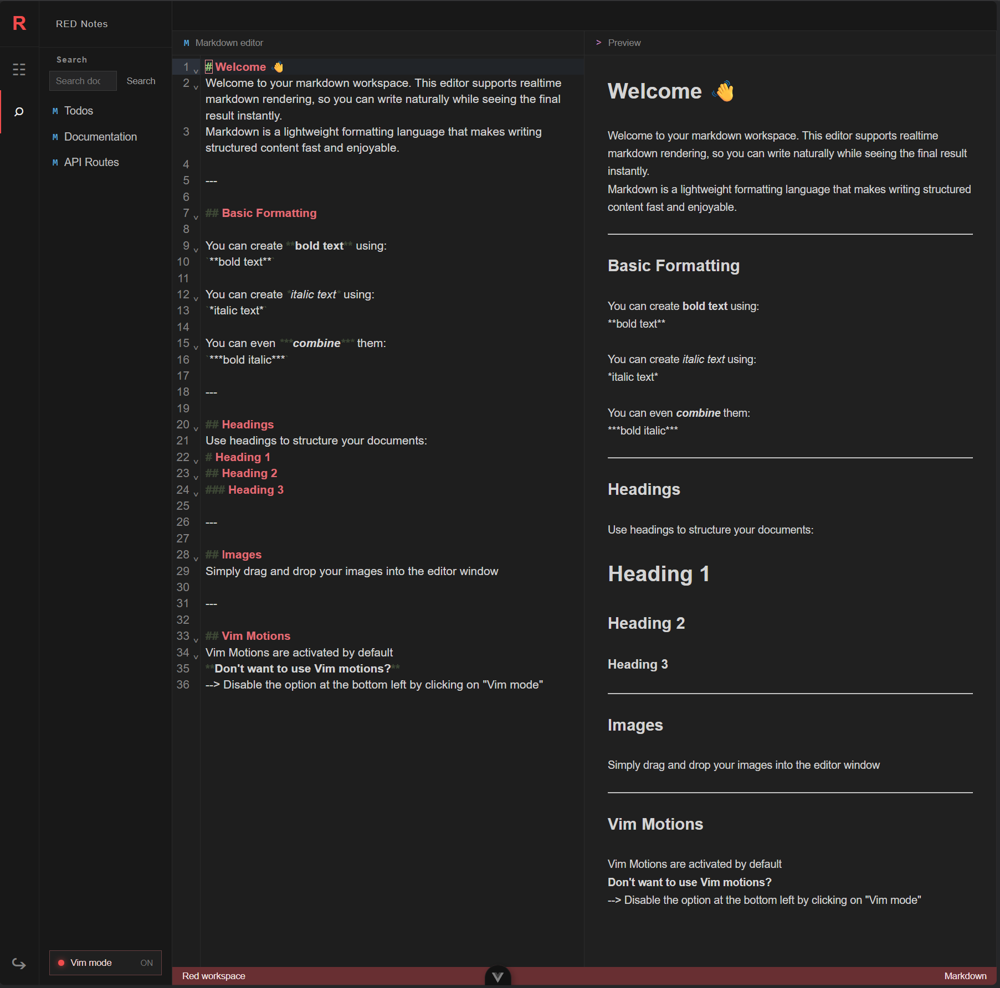

- max-width 960px: no longer display the preview pane

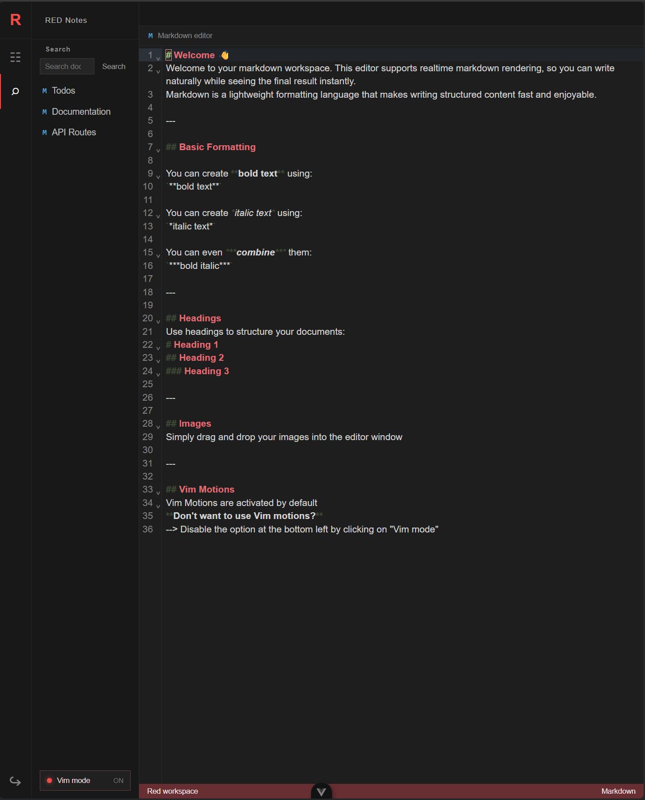

- max-width 576px: 
  - further reduce the size of the sidebar
  - adjust sidebar elements to fit the new size
  - reduce the width of individual tabs

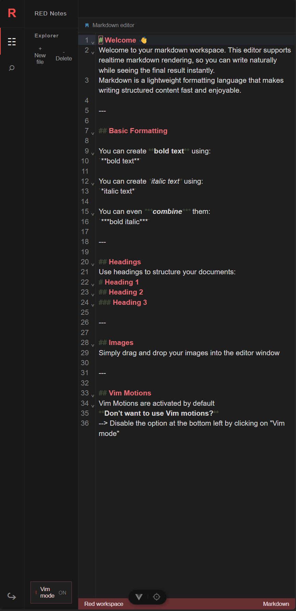

## Dependencies

### Production Dependencies

- `vue`  
  Core framework for the Vue 3 UI and component system used throughout the app.

- `vue-router`  
  Handles page navigation and route definitions for the application views.

- `codemirror`  
  Provides the base CodeMirror editor framework used in the document editor.

- `@codemirror/lang-markdown`  
  Adds Markdown language support and syntax handling inside the editor.

- `@codemirror/theme-one-dark`  
  Applies the One Dark theme to the editor interface.

- `@replit/codemirror-vim`  
  Enables Vim-style key bindings for the editor.

- `marked`  
  Converts Markdown content into HTML for rendering the document preview.

- `dompurify`  
  Sanitizes rendered HTML to reduce XSS risk before displaying Markdown content.

### Development Dependencies

- `vite`  
  Build tool and local dev server for the Vue frontend.

- `@vitejs/plugin-vue`  
  Adds Vue support to the Vite build pipeline.

- `vite-plugin-vue-devtools`  
  Integrates Vue devtools into the local development experience.

- `vitest`  
  Runs the frontend unit and integration tests.

- `jsdom`  
  Provides a browser-like DOM environment for tests.

- `fake-indexeddb`  
  Simulates IndexedDB in tests for local document and image storage behavior.